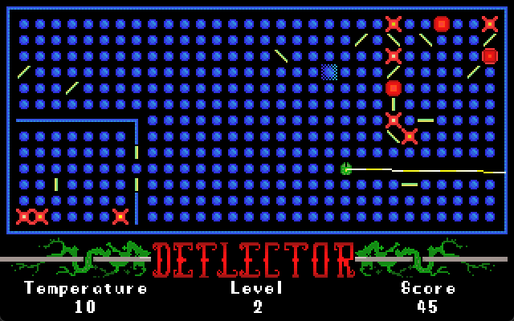
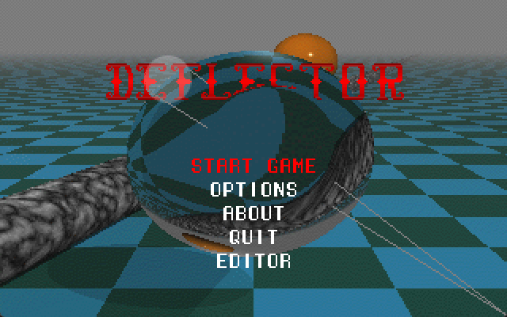

# Deflector

Welcome to Deflector, a Deflektor clone written in Pascal.

This remake was created in 1995, and it was written in Turbo Pascal + bits of assembler. Gameplay is slightly different than the original, main differences being that you can rotate the laser beam, the level is completed once you destroy all the balls, there is no timer and there's only one life (yolo baby!).

This was, if I remember correctly, the 6th game made for PC and it worked on a 386-40DX. It was released under the previous incarnation of Piron Games, pompously named "Wings of Sorrow" (W.O.S.)

Game logo was created by my friend Traian Pop.

In 2024, I've decided to port it to Free Pascal. 

I've started off by creating an intermediary "fpc-dos" project, which improves on the original (implements correctly timer, keyboard and events sub-systems) while still working under MS-DOS. This one is still work-in-progress, takes a while to remember all the low level DOS system programming.

Eventually, I've made it work with SDL2 as well, while also bug fixing and adding new features (gamepad support, built-in game editor, etc)

Only 3 test levels are available.

This game has a special meaning to me, as I kept returning to explore its mechanics over the years. Check out [Laser Lab](https://www.pirongames.com/laser-lab/), a similar browser game I've started to develop in 2012 and finally released in 2018.

## License

Code license:
https://opensource.org/licenses/MIT

Graphics license:
https://creativecommons.org/licenses/by-nc-sa/4.0/

Music:
[Neon Techno by Drozerix](https://modarchive.org/index.php?request=view_by_moduleid&query=178172) - public domain

## Media





## Setup (General)

This project uses submodules and they need to be initialized. 

After cloning the project, run:

```
git submodule init
git submodule update
```

Alternatively, pass --recurse-submodules to git clone (or tick the box in your clone popup if you have a visual git client).

## Setup&Install&Build (FPC SDL2)

Install Free Pascal Compiler (version 3.2.2+)

Run build_deflector.bat to build and run the game. Ingame editor is available if you build the debug version.

SDL2 DLLs are required to run the build:
* SDL2_image.dll
* SDL2_mixer.dll
* SDL2_ttf.dll
* libxmp.dll 
* SDL2.dll

You may find them in the release packages or feel free to use your own.

## Setup&Install&Build (FPC DOS)

Install Free Pascal Compiler (version 3.2.2+) and the [Free Pascal 16-bit DOS cross-compiler](https://www.freepascal.org/down/i8086/msdos-canada.var)

Run build_deflector.bat to build the game.

The resulting executable has to be run from a MS-DOS emulator. It's been tested with DOSBox, but it might work under an original MS-DOS installation or FreeDOS.

This version lacks music and the editor has not been tested yet.


## Setup&Install&Build (original)

This may only be built using Turbo Pascal/Borland Pascal. It's provided for historical purposes only.

## Gameplay
Use arrow keys or D-Pad to move the cursor.

Use O/P or gamepad shoulder buttons to rotate the laser beam.

Use Return/gamepad A for action (rotate mirrors)

Use Escape or gamepad back to return to menu.

Complete the level by clearing all the balls.

In debug mode, the following keyboard shortcuts are available:
* Q to complete the game
* W to complete the level
* E to fail the level/game (and play the awesome "Doom melt"-like animation)

## Editor

The editor is pretty raw, but it offers all the functionalities to create working levels.

A level has to be encased in walls, otherwise bad things will happen.

It's mostly designed for keyboard, but gamepad navigation also works. The following keyboard shortcuts are available:
* page up/down to change selection
* Return to replace selection
* Home to place the laser generator
* Delete to delete a tile
* End to toggle mirror type (rotating or non rotating)
* +/- to change the level to edit (up to MAX_LEVELS, which is 100)
* S to save the level to file (will be saved to data/gamedata/levels.dat)
* C to clear the level with the template (borders + laser generator). There is no confirmation or undo, so use with caution.

Make sure to backup/branch/stash before editing ;)

## Cheats
Open settings.json and locate the sections "cheats" and "flow".

Note that some cheats may work only in the debug build.

These are:
* "spacewarp": starting level
* "skipintro": skip the game intro
* "nofadeout": skip fadeouts


## TODO
* free form mirror rotations (instead of 45 degrees increments)
* rotate mirror in both directions 
* switch to json levels file instead of binary
* per menu option color
* return to the previous menu option 
* implement ghosts (travel randomly and re-arrange static mirrors)
* implement wormhole
* add support to finish the level by connecting to the end point like in the original
* add support for fixed laser (to extend the mechanics range)
* ingame laser line optimization - don't draw each pixel but draw line between collisions
* add lives support 
* create more levels
* fullscreen support
